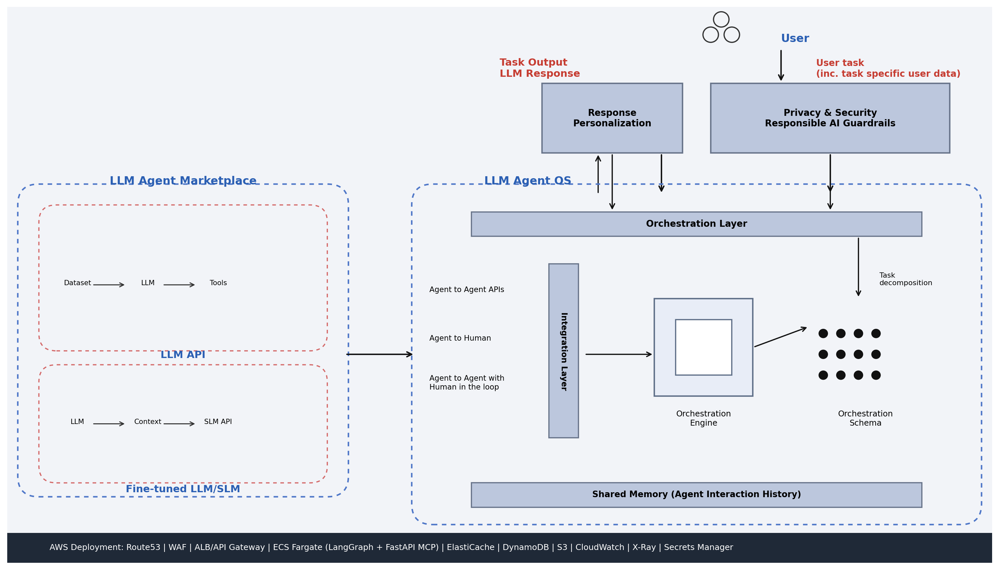
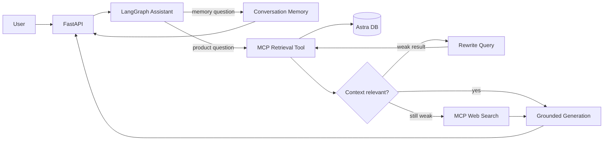

# ShopBuddy — Agentic AI Product Assistant

[](https://github.com/Narang-Garima/AI-Prod-Assistant/actions/workflows/ci.yml)
[](https://www.python.org/)

ShopBuddy is an agentic product-research assistant that combines local product-review retrieval with an MCP-based web-search fallback. A LangGraph workflow routes each request, evaluates retrieved context, rewrites weak queries, and generates a grounded response while preserving conversation state.



## What the project demonstrates

- Stateful orchestration with LangGraph and `MemorySaver`
- MCP tool discovery and asynchronous tool invocation
- Local-first retrieval from Astra DB with MMR search
- Context grading, bounded query rewriting, and web fallback
- Follow-up and conversation-memory handling
- RAGAS-based context-precision and response-relevancy evaluation
- FastAPI chat and analytics endpoints with SQLite history
- Container, Kubernetes, and AWS EKS deployment assets
- Automated tests for routing, API behavior, prompts, and retrieval helpers

## Request flow



The rewrite loop is bounded to prevent uncontrolled agent execution. Local retrieval is attempted before web search so answers prefer the curated product-review corpus.

## Technology

| Area | Implementation |
|---|---|
| Orchestration | LangGraph state graph and in-memory checkpointing |
| Tool protocol | FastMCP server and LangChain MCP adapters |
| Retrieval | Astra DB vector store with MMR (`k=5`, `fetch_k=50`) |
| Models | Configurable OpenAI, Google Gemini, or Groq chat models |
| Embeddings | Google `gemini-embedding-001` |
| Evaluation | RAGAS context precision and response relevancy |
| API/UI | FastAPI, Jinja templates, HTML/CSS/JavaScript |
| Persistence | Astra DB for vectors; SQLite for chat history |
| Delivery | Docker, Kubernetes manifests, and AWS EKS template |

## Repository layout

```text
src/prod_assistant/
├── workflow/       LangGraph agent and routing
├── mcp_servers/    Product-retrieval and web-search tools
├── retriever/      Astra DB retrieval and result cleanup
├── evaluation/     RAGAS evaluation helpers
├── router/         FastAPI application
├── etl/            Product-data ingestion
└── config/         Model and retrieval configuration

test/               Automated test suite
docs/architecture/  Architecture diagrams and source files
infra/              AWS EKS infrastructure template
k8/                 Kubernetes deployment and service
```

## Local setup

Requirements: Python 3.11 and credentials for Astra DB plus at least one configured chat-model provider.

```powershell
git clone https://github.com/Narang-Garima/AI-Prod-Assistant.git
cd AI-Prod-Assistant
python -m venv .venv
.venv\Scripts\Activate.ps1
pip install -e ".[dev]"
Copy-Item .env.example .env
```

Fill in `.env`, then start the two services in separate terminals:

```powershell
$env:MCP_TRANSPORT="streamable-http"
python src/prod_assistant/mcp_servers/product_search_server.py
```

```powershell
$env:MCP_SERVER_URL="http://127.0.0.1:8001/mcp"
uvicorn prod_assistant.router.main:app --reload --port 8000
```

Open `http://127.0.0.1:8000`. The health endpoint is available at `http://127.0.0.1:8000/health`.

## Configuration

Copy `.env.example` and provide secrets locally. Never commit the resulting `.env` file.

Important settings:

- `LLM_PROVIDER`: `openai`, `google`, or `groq`
- `ASTRA_DB_API_ENDPOINT`, `ASTRA_DB_APPLICATION_TOKEN`, `ASTRA_DB_KEYSPACE`
- `MCP_SERVER_URL`: streamable HTTP endpoint used by the LangGraph client
- `MCP_RELEVANCY_THRESHOLD`: judge-model threshold before accepting local context
- `MCP_OVERLAP_THRESHOLD`: lexical-overlap guard against unrelated retrieval

Retrieval and model defaults are defined in `src/prod_assistant/config/config.yaml`.

## Validation

```powershell
$env:PYTHONPATH="src"
pytest -q
```

The test suite uses stubs for external services, so core routing and API behavior can be validated without exposing credentials.

## Evaluation approach

The retrieval tool applies several checks before generation:

1. MMR retrieval from the Astra DB collection
2. Deduplication and removal of low-signal review fragments
3. Product/category and exact-model checks
4. Lexical-overlap threshold
5. RAGAS response-relevancy evaluation
6. Query rewrite or web-search fallback when local evidence is insufficient

## Current limitations and production roadmap

- `MemorySaver` is process-local; production should use a durable shared checkpointer.
- The API does not yet implement user authentication or authorization.
- Web-search results need stronger citation capture and source allow-listing.
- Evaluation currently runs inline for retrieval decisions, which can increase latency and cost.
- A production deployment should add distributed tracing, token/cost metrics, rate limiting, secret management, and approval controls for tools that perform actions.
- The Docker image launches the API and MCP server together for demonstration; production should deploy and scale them independently.

## Interview talking point

This project is an agentic workflow rather than an unrestricted autonomous agent. Routing and retries are explicit, rewrites are bounded, and the tool surface is intentionally small. That design makes behavior easier to test, monitor, and govern.
