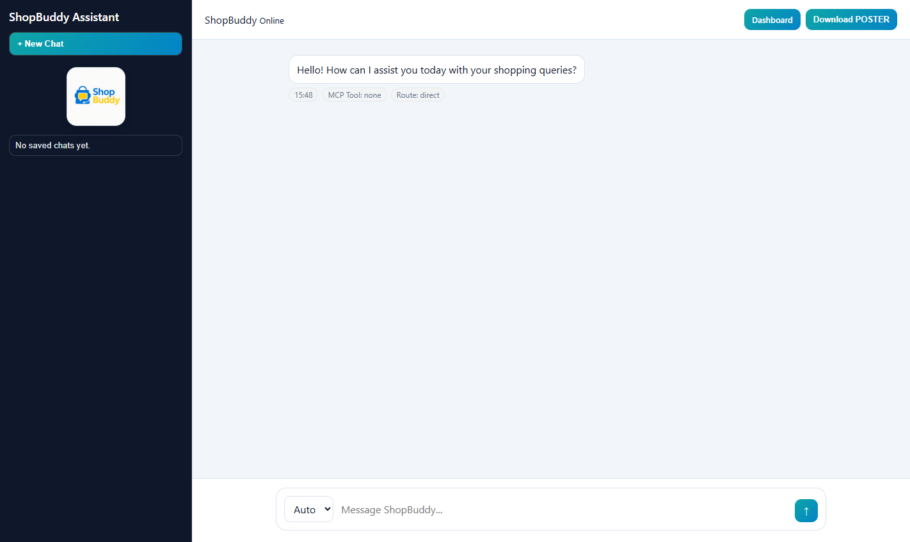
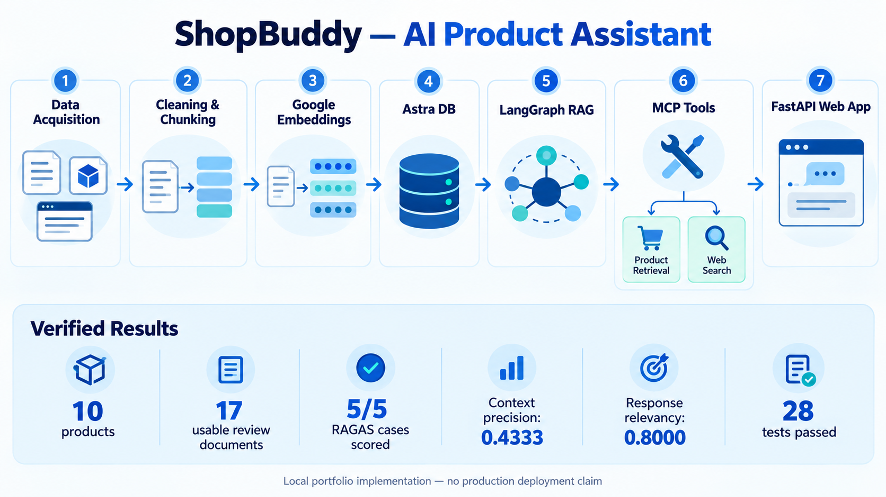
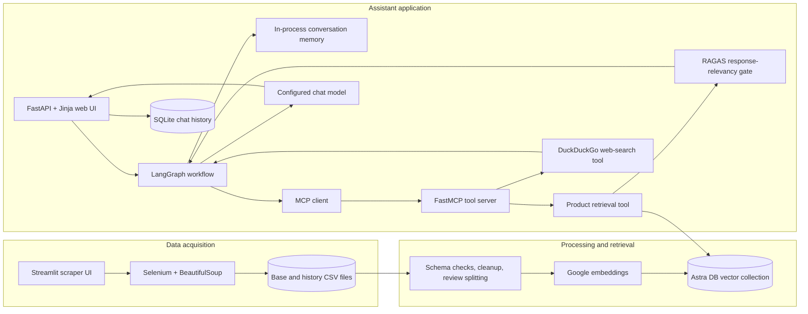

# ShopBuddy — AI Product Assistant




ShopBuddy is an end-to-end Applied GenAI project for researching products from review evidence. I built it to connect the complete workflow: acquiring product-review data, cleaning and embedding it, retrieving relevant evidence, orchestrating bounded RAG decisions through LangGraph and MCP tools, and serving the result through an API-backed web application.

This repository is a portfolio implementation. It demonstrates the system design and working local components; it does not claim production traffic, enterprise scale, a live cloud deployment, or model fine-tuning.

## Business problem

Product research is fragmented across long review pages and changing web results. ShopBuddy tries the curated review corpus first, keeps product metadata attached to each review chunk, and falls back to web search when local evidence is absent or weak. The goal is a more useful product-research workflow than a generic chatbot: answers are routed through explicit retrieval, validation, fallback, and response-generation stages.

## End-to-end architecture





The editable diagram source is in [`docs/architecture/system-flow.mmd`](docs/architecture/system-flow.mmd).

## Data flow

1. The Streamlit acquisition interface accepts one or more product searches.
2. Selenium opens Flipkart pages; BeautifulSoup selectors and cleanup heuristics extract product fields and review text.
3. The current deduplicated dataset is written to `data/product_reviews.csv`. The analytics variant also appends run metadata to `data/product_reviews_history.csv`.
4. The ingestion pipeline validates the expected CSV columns, normalizes null-like values, splits `||`-separated reviews, and creates one LangChain `Document` per review.
5. Google `gemini-embedding-001` embeddings and review metadata are stored in an Astra DB vector collection.
6. Retrieval uses maximum marginal relevance, then removes short/noisy and duplicate review chunks before returning evidence.

Scraping depends on a compatible local Chrome installation and Flipkart's current markup. Selectors can require maintenance when the site changes. Review data is runtime data and is intentionally excluded from Git.

## RAG and tool flow

The LangGraph workflow has explicit nodes for assistant routing, memory, retrieval, grading, rewriting, web search, generation, and fallback.

- Greetings and empty-input handling do not call a tool.
- Memory questions use LangGraph's in-process `MemorySaver` state for the current thread.
- Product questions call the MCP `get_product_info` tool first.
- The retrieval tool applies category, lexical-overlap, and exact-model checks. It then runs RAGAS `ResponseRelevancy` before accepting local context.
- Weak context can trigger one query rewrite; the total rewrite count and graph recursion limit are configured in `config.yaml`.
- Missing or unsuitable local evidence routes to the MCP DuckDuckGo tool.
- The configured chat model generates the final response from the selected context.

This is a constrained agentic workflow, not an unrestricted autonomous agent. The implemented tool surface contains two read-only tools: local product retrieval and web search.

## Components

| Area | Implemented component |
|---|---|
| Acquisition | Streamlit, Selenium, undetected-chromedriver, BeautifulSoup |
| Processing | pandas schema validation, normalization, review splitting, metadata construction |
| Embeddings/vector store | Google embeddings and Astra DB via `AstraDBVectorStore` |
| Retrieval | MMR retrieval with configurable `k`, `fetch_k`, and diversity weight |
| Orchestration | LangGraph state graph with bounded rewriting and in-process checkpointing |
| Tools | FastMCP server with product-retrieval and DuckDuckGo search tools |
| Backend/UI | FastAPI, Jinja templates, HTML/CSS/JavaScript, dashboard endpoints |
| Persistence | Astra DB for vectors, SQLite for chat history, CSV for scrape history |
| Evaluation | Inline RAGAS response relevancy; five-case retrieval benchmark with context precision |
| Testing | pytest unit/API tests with external services stubbed |

The primary assistant UI is the FastAPI/Jinja application. Streamlit is used for the data-acquisition workflow, not for the chat interface.

## Repository layout

```text
src/prod_assistant/
├── config/          Model, retrieval, and graph settings
├── etl/             Scraping, CSV transformation, and Astra ingestion
├── evaluation/      RAGAS scoring helpers
├── mcp_servers/     MCP server and local client example
├── retriever/       Astra vector retrieval and cleanup
├── router/          FastAPI routes, dashboard, and chat history
├── workflow/        LangGraph RAG workflow
└── utils/           Configuration and model loaders

templates/           Assistant and analytics web pages
static/              UI styling and logo
test/                Automated tests
docs/                Architecture and verification notes
infra/ and k8/       Optional, unverified deployment definitions
```

## Local setup

Python 3.10 or 3.11 is required. Python 3.11 is the locally verified version.

```powershell
git clone https://github.com/Narang-Garima/AI-Prod-Assistant.git
cd AI-Prod-Assistant
python -m venv .venv
.venv\Scripts\Activate.ps1
python -m pip install --upgrade pip
pip install -e ".[dev]"
Copy-Item .env.example .env
```

Fill in `.env` locally. Do not commit it.

- One chat-model key is required for the selected `LLM_PROVIDER` (`openai`, `google`, or `groq`).
- Local vector retrieval additionally requires `GOOGLE_API_KEY`, `ASTRA_DB_API_ENDPOINT`, `ASTRA_DB_APPLICATION_TOKEN`, and `ASTRA_DB_KEYSPACE`.
- The Google key is required even when OpenAI or Groq generates responses because the implemented vector pipeline uses Google embeddings.

## Acquire and ingest data

Start the Streamlit acquisition UI:

```powershell
streamlit run scrape_buddy_powerbi.py
```

After scraping, use the UI's **Store in Vector DB** action, or run:

```powershell
python -m prod_assistant.etl.data_ingestion
```

The scraper launches visible Chrome by default and normally auto-detects its major version. Set `CHROME_VERSION_MAIN` only when driver auto-detection needs an explicit override.

## Run the assistant

Start the MCP server:

```powershell
$env:MCP_TRANSPORT="streamable-http"
python -m prod_assistant.mcp_servers.product_search_server
```

In a second terminal, start FastAPI:

```powershell
$env:MCP_SERVER_URL="http://127.0.0.1:8001/mcp"
uvicorn prod_assistant.router.main:app --reload --port 8000
```

Open `http://127.0.0.1:8000`. Configuration status is available at `http://127.0.0.1:8000/health`; the endpoint reports only booleans and setting names, never secret values.

## Testing and evaluation

```powershell
pytest -q
```

The automated suite validates configuration, prompts, scraper/ingestion transformations, MCP helper logic, graph routing, CSV history, and API endpoints. My latest local run completed with 28 passing tests and one third-party LangGraph warning. External services are stubbed in these tests, so I verify live Astra, model-provider, DuckDuckGo, and Flipkart connectivity separately.

RAGAS is genuinely present, but its scope is limited:

- `ResponseRelevancy` runs inline as a retrieval acceptance gate and therefore adds model latency/cost.
- `LLMContextPrecisionWithoutReference` is included in the five-case retrieval benchmark.
- The benchmark and runner are checked in under `evaluation/` and `scripts/`. My latest five-case run completed all metrics with mean context precision `0.4333` and mean response relevancy `0.8000`; I report the case-level results as well because the aggregate hides a failed sunscreen case and a misleading negative-control score.

Run it after configuring the required services:

```powershell
python scripts/run_retrieval_evaluation.py
```

See [`docs/evaluation.md`](docs/evaluation.md) for the dataset scope and current score status.

See [`docs/verification.md`](docs/verification.md) for dated commands, observed results, and environment limitations.

### Latest local benchmark

I expanded the live review sample from 3 raw products/5 transformed documents to a curated dataset of 10 products and 17 usable review documents. I inserted 13 new documents into the existing Astra collection without reinserting the original evidence.

The five-case RAGAS run completed on Gemini Flash Lite:

| Metric | Scored cases | Mean |
|---|---:|---:|
| Context precision without reference | 5/5 | 0.4333 |
| Response relevancy | 5/5 | 0.8000 |

These numbers are a baseline, not a production quality claim. The negative control still retrieved nearest-neighbor contexts and received high response relevancy, so the next retrieval improvement is a similarity threshold or explicit no-evidence gate.

I also ran a real product question through FastAPI, LangGraph, the MCP `get_product_info` tool, Astra retrieval, the inline RAGAS gate, and Gemini generation. The request returned HTTP 200 with an 801-character answer, route `retriever`, and no provider error.

## Current limitations and next improvements

- Astra DB and model-provider calls require locally configured credentials and network access.
- `MemorySaver` is process-local and is not shared across workers or restarts.
- The scraper is tied to changing third-party HTML and a compatible local Chrome installation.
- Web fallback returns search text without a first-class citation model or source allow-list.
- Inline RAGAS evaluation increases latency and cost.
- Vector retrieval currently has no similarity threshold, so an out-of-corpus question can still return nearest-neighbor evidence.
- SQLite and local CSV history are suitable for a local portfolio demo, not multi-instance concurrency.
- The API has no end-user authentication, authorization, rate limiting, or production guardrails.
- Docker, Kubernetes, EKS, and CI definitions are repository assets; I have not verified a live cloud deployment.

Good next steps would be evaluation thresholds and regression tracking, cited web results, a durable checkpointer, provider-independent embeddings, and deployment validation. Those are roadmap items, not current features.

## Portfolio talking points

- I designed the full path from review acquisition and data cleaning to retrieval, RAG orchestration, tools, API, and UI.
- I used MCP to isolate the retrieval and web-search capabilities behind a small, testable tool interface.
- I kept agent behavior bounded with explicit LangGraph routes, configurable rewrite limits, and deterministic retrieval checks.
- I treated evaluation as part of the retrieval decision while documenting the cost and coverage trade-offs.
- I separated verified local behavior from optional cloud definitions and future production work.
